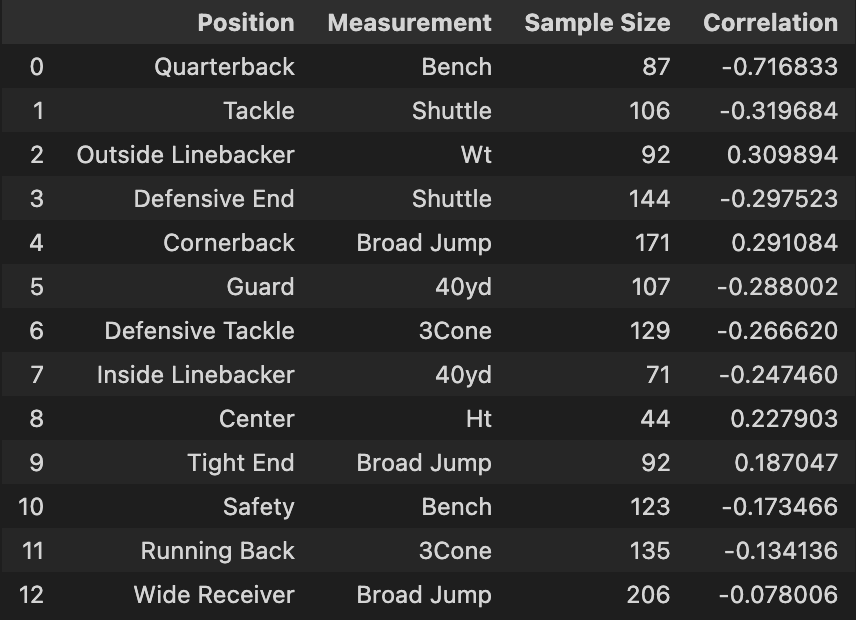

# CombineCorrelations
Looking at correlations between NFL combine drills and player second year contract values

Data courtest of [Pro Football Reference](https://www.pro-football-reference.com/) and [Spotrac](https://www.spotrac.com/)

Essentially, the goal of this project was to look at which combine drill was most important for each position.I did just something simple, where I looked at which combine workouts for each position had the highest correlation to second contract value. In order to control for contracts rising over time, I normalized each of their second contracts based on all the contracts that had been signed at their position between the year 2000 and when they signed theirs. I looked at players from the 2013 draft until now who had signed second contracts, and normalized their contracts against those signed since 2000.

